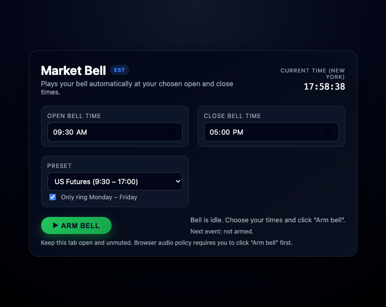

# Market Bell

## Description
Market Bell is a responsive, web-based trading utility designed to audibly alert traders when the stock market opens and closes. It features a live Eastern Standard Time (EST) clock, customizable alarm schedules, and preset configurations for US Stocks and Futures markets. The application is built with a dark-themed UI to reduce eye strain during long trading sessions.

## Table of Contents
* [Installation](#installation)
* [Usage](#usage)
* [License](#license)
* [Features](#features)

## Installation
*   **[Project Repo](https://github.com/shaynefw/marketbell)**
*   **[Project Deployed Link](https://shaynefw.github.io/marketbell/)**

## Usage

1.  **Open the Application**: Navigate to the deployed link.
2.  **Select a Schedule**: Use the dropdown to select "US Stocks" (9:30 - 4:00) or "US Futures" (9:30 - 5:00).
3.  **Customize (Optional)**: Manually adjust the times if you trade specific hours.
4.  **Arm the Bell**: Click the **"▶ Arm bell"** button. The application requires user interaction to comply with browser autoplay policies.
5.  **Leave Open**: Keep the tab open in the background. The bell will ring automatically at your set times.

## License
MIT License

Copyright (c) 2025

Permission is hereby granted, free of charge, to any person obtaining a copy of this software and associated documentation files (the "Software"), to deal in the Software without restriction, including without limitation the rights to use, copy, modify, merge, publish, distribute, sublicense, and/or sell copies of the Software, and to permit persons to whom the Software is furnished to do so, subject to the following conditions:

The above copyright notice and this permission notice shall be included in all copies or substantial portions of the Software.

THE SOFTWARE IS PROVIDED "AS IS", WITHOUT WARRANTY OF ANY KIND, EXPRESS OR IMPLIED, INCLUDING BUT NOT LIMITED TO THE WARRANTIES OF MERCHANTABILITY, FITNESS FOR A PARTICULAR PURPOSE AND NONINFRINGEMENT. IN NO EVENT SHALL THE AUTHORS OR COPYRIGHT HOLDERS BE LIABLE FOR ANY CLAIM, DAMAGES OR OTHER LIABILITY, WHETHER IN AN ACTION OF CONTRACT, TORT OR OTHERWISE, ARISING FROM, OUT OF OR IN CONNECTION WITH THE SOFTWARE OR THE USE OR OTHER DEALINGS IN THE SOFTWARE.

## Badges

## Features
**Live EST Clock**: Displays the current time in New York (EST/EDT) to ensure traders are synchronized with market hours.

**Smart Scheduling**: Includes logic to prevent the alarm from ringing multiple times for the same event and detects weekends automatically.

**User-Friendly Controls**: Features a clear "Arm/Disarm" toggle that locks input fields to prevent accidental changes while the timer is active.

**Presets**: One-click configuration for standard US Stock Market and Futures Market hours.

**Dark Mode**: A modern, contrast-rich interface designed for professional trading environments.
